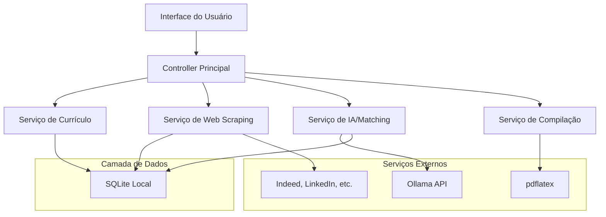

# Design Document

## Overview

O aplicativo de matching de vagas será construído como uma aplicação Python desktop/CLI que integra web scraping, processamento de documentos LaTeX, IA local via Ollama, e análise de compatibilidade. A arquitetura seguirá o padrão MVC com separação clara entre coleta de dados, processamento de IA, e interface do usuário.

## Architecture

### High-Level Architecture



### Fluxo de Dados Principal

1. **Upload de Currículo**: LaTeX → Validação → Armazenamento → Análise IA
2. **Web Scraping**: Sites → Extração → Normalização → Armazenamento
3. **Matching**: Keywords + Vagas → Algoritmo de Similaridade → Ranking
4. **Adaptação**: Currículo Original + Vaga → IA → Currículo Adaptado → Revisão do Usuário → PDF

## Components and Interfaces

### 1. Resume Service (Serviço de Currículo)

```python
class ResumeService:
    def upload_latex_resume(self, file_path: str) -> Resume
    def validate_latex(self, content: str) -> bool
    def extract_keywords_with_ai(self, resume_id: int) -> List[str]
    def compile_to_pdf(self, latex_content: str) -> bytes
    def adapt_resume_for_job(self, resume_id: int, job_id: int) -> str
    def save_adapted_resume_draft(self, adapted_content: str) -> int
    def get_adapted_resume_for_editing(self, draft_id: int) -> str
    def update_adapted_resume(self, draft_id: int, content: str) -> None
```

**Responsabilidades:**
- Validação e armazenamento de currículos LaTeX
- Integração com Ollama para extração de keywords
- Compilação LaTeX para PDF
- Adaptação de currículos para vagas específicas
- Gerenciamento de rascunhos de currículos adaptados para edição do usuário

### 2. Web Scraping Service

```python
class JobScrapingService:
    def scrape_indeed(self, keywords: List[str]) -> List[JobListing]
    def scrape_linkedin(self, keywords: List[str]) -> List[JobListing]
    def normalize_job_data(self, raw_data: dict) -> JobListing
    def schedule_scraping_tasks(self) -> None
```

**Responsabilidades:**
- Scraping de múltiplos sites de vagas
- Normalização de dados de diferentes fontes
- Rate limiting e gerenciamento de sessões
- Agendamento de coletas periódicas

### 3. AI Matching Service

```python
class AIMatchingService:
    def __init__(self, ollama_client: OllamaClient)
    def extract_resume_keywords(self, latex_content: str) -> List[str]
    def calculate_job_compatibility(self, resume_keywords: List[str], job: JobListing) -> float
    def rank_jobs_by_compatibility(self, jobs: List[JobListing], keywords: List[str]) -> List[JobMatch]
    def adapt_resume_content(self, original_latex: str, job_requirements: str) -> str
```

**Responsabilidades:**
- Comunicação com Ollama para análise de texto
- Algoritmos de matching e ranking
- Adaptação inteligente de currículos
- Processamento multilíngue (PT/EN)

### 4. User Interface Controller

```python
class JobMatchingController:
    def display_job_listings(self, page: int = 1) -> None
    def show_job_details(self, job_id: int) -> None
    def manage_keywords(self, resume_id: int) -> None
    def trigger_resume_adaptation(self, resume_id: int, job_id: int) -> None
    def show_adapted_resume_editor(self, draft_id: int) -> None
    def save_edited_resume(self, draft_id: int, content: str) -> None
    def compile_and_download_resume(self, draft_id: int) -> None
```

**Responsabilidades:**
- Interface de linha de comando ou GUI simples
- Paginação de resultados (30 por página)
- Gerenciamento de keywords pelo usuário
- Coordenação entre serviços
- Editor de currículos adaptados antes da compilação final

## Data Models

### Resume Model
```python
@dataclass
class Resume:
    id: int
    filename: str
    latex_content: str
    extracted_keywords: List[str]
    user_keywords: List[str]  # Keywords editadas pelo usuário
    created_at: datetime
    updated_at: datetime

@dataclass
class AdaptedResumeDraft:
    id: int
    original_resume_id: int
    job_id: int
    adapted_latex_content: str
    is_user_edited: bool
    created_at: datetime
    updated_at: datetime
```

### Job Listing Model
```python
@dataclass
class JobListing:
    id: int
    title: str
    company: str
    location: str
    remote_type: RemoteType  # REMOTE, ONSITE, HYBRID
    experience_level: ExperienceLevel  # INTERN, JUNIOR, MID, SENIOR
    technologies: List[str]
    description: str
    source_url: str
    application_url: str
    scraped_at: datetime
```

### Job Match Model
```python
@dataclass
class JobMatch:
    job: JobListing
    compatibility_score: float
    matching_keywords: List[str]
    missing_keywords: List[str]
```

## Error Handling

### Web Scraping Errors
- **Rate Limiting**: Implementar backoff exponencial
- **Site Indisponível**: Continuar com outros sites, log de erro
- **Estrutura Alterada**: Fallback para parsing genérico
- **Bloqueio por Bot**: Rotação de User-Agents e proxies

### IA/Ollama Errors
- **Serviço Indisponível**: Fallback para keywords pré-definidas
- **Timeout**: Retry com timeout aumentado
- **Resposta Inválida**: Parsing robusto com validação

### LaTeX Compilation Errors
- **Sintaxe Inválida**: Validação prévia e mensagens específicas
- **Pacotes Ausentes**: Lista de dependências requeridas
- **Falha na Compilação**: Log detalhado e sugestões de correção

### Database Errors
- **Conexão Perdida**: Reconnect automático
- **Constraint Violations**: Validação antes de inserção
- **Backup/Recovery**: Estratégia de backup automático

## Testing Strategy

### Unit Tests
- **Resume Service**: Validação LaTeX, extração de keywords
- **Scraping Service**: Parsing de HTML, normalização de dados
- **AI Service**: Mocking do Ollama, algoritmos de matching
- **Controllers**: Lógica de interface e coordenação

### Integration Tests
- **Ollama Integration**: Testes com modelo real em ambiente de teste
- **Database Operations**: Testes com banco de dados temporário
- **LaTeX Compilation**: Testes com documentos de exemplo

### End-to-End Tests
- **Fluxo Completo**: Upload → Análise → Scraping → Matching → Adaptação
- **Error Scenarios**: Testes de falha em cada componente
- **Performance Tests**: Tempo de resposta para grandes volumes

### Test Data
- **Currículos de Exemplo**: Diversos formatos LaTeX
- **Vagas Mock**: Dados estruturados para testes
- **Keywords Padrão**: Listas para validação de extração

## Technology Stack

### Core Framework
- **Python 3.11+**
- **FastAPI** (se API REST for necessária)
- **Click** (para interface CLI)
- **Rich** (para interface CLI colorida)

### Web Scraping
- **Scrapy** - Framework principal
- **BeautifulSoup4** - Parsing HTML
- **Selenium** - Sites com JavaScript
- **requests-html** - Alternativa leve

### Database
- **SQLAlchemy** - ORM
- **Alembic** - Migrações
- **SQLite** - Banco local para desenvolvimento e uso pessoal

### AI/ML
- **ollama-python** - Cliente oficial Ollama
- **langchain** - Orquestração LLM
- **sentence-transformers** - Embeddings
- **scikit-learn** - Algoritmos de matching

### Document Processing
- **PyLaTeX** - Manipulação LaTeX
- **subprocess** - Compilação pdflatex
- **PyPDF2** - Manipulação PDF

### Utilities
- **pydantic** - Validação de dados
- **python-dotenv** - Configuração
- **loguru** - Logging avançado
- **pytest** - Testes